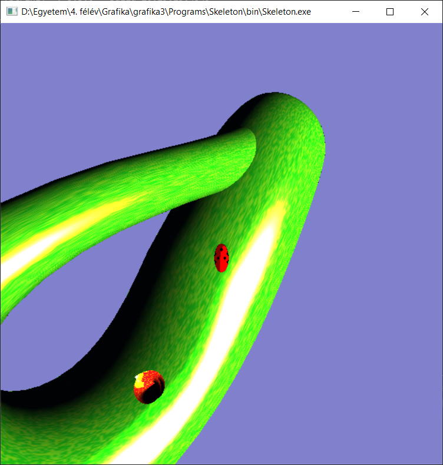

# Grafika 3. házi feladat

## Feladatleírás

Klein Katica (Coccinella septempunctata kleina) egy Klein kancsó geometriájú bolygó lakója, és a földi rokonához hasonlóan félellipszoid (nem gömb!) formája van, amit piros alapon 7 fekete pötty díszít. Klein Katica elindult felderíteni a textúrázott bolygóját, amelyen legalább kettő textúrázott Dini felület jelenti a növényzetet. A nap látszólag a q kvaterinó szerint forog a bolygó AABB-jének középpontja körül (t az eltelt idő sec). Katica a bolygó u izoparametrikus görbéjéhez (hosszúsági kör) képest adott szögben halad, a szöget pedig az ‘a’ billentyűvel lehet növelni, az ‘s’-sel csökkenteni. Feltételezheti, hogy az u, v izoparametrikus görbék egymást merőlegesen metszik. Az avatárunk Katicát kissé lemaradva követi kezdetben olyan magasságból, hogy a teljes bolygó látható legyen, a SPACE hatására viszont közvetlen közeléből. A Klein bolygón a Helmholtz szimmetria megsértése és a numerikus differenciálás főbenjáró bűn, ezért a bolygót és növényeket egyéni ízlés szerinti diffúz + szimmetrikus! spekuláris modell szerint kell megjeleníteni, a deriváltakat pedig analitikusan! kell számítani. Katica NPR módon illegeti magát.

Screenshot:

